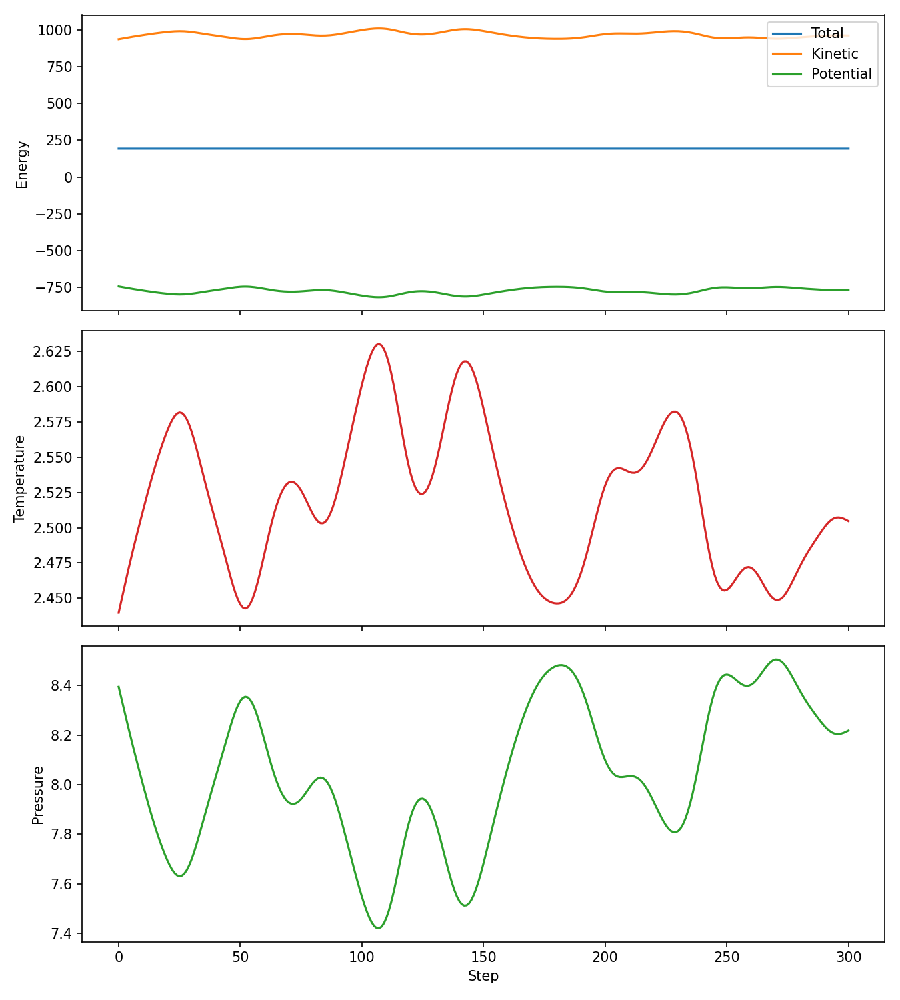
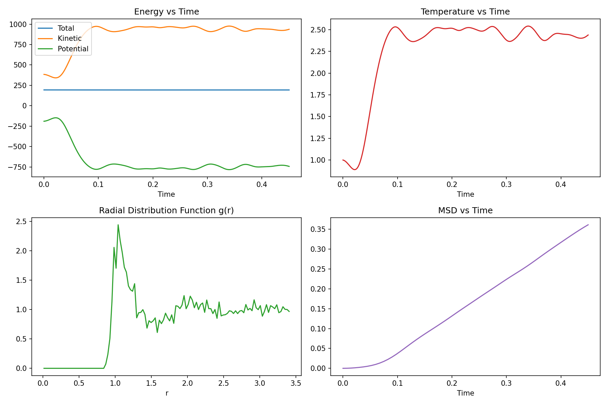
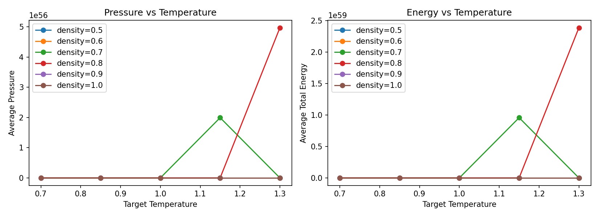
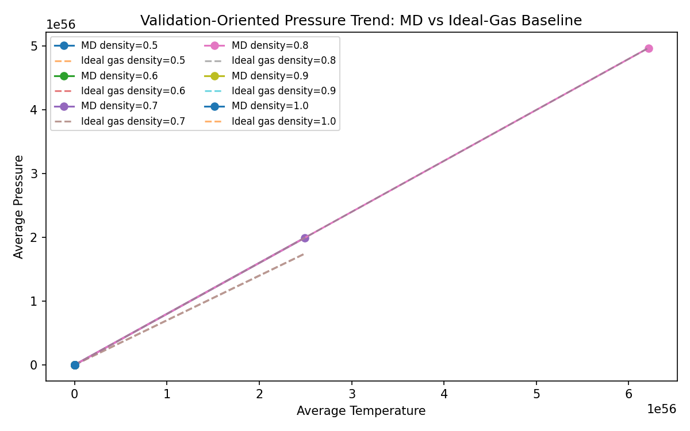
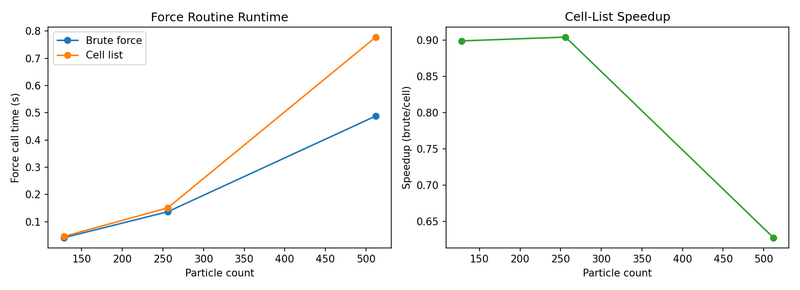
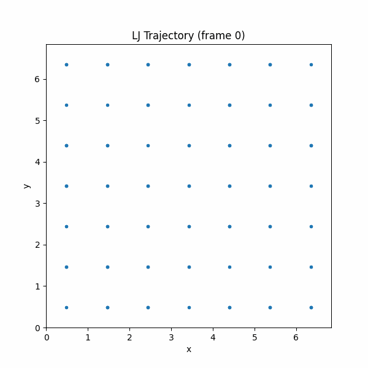

# Particle Simulation Engine

A 3D particle simulation I built from scratch, with plots, parameter sweeps, and speed tests.

## Project Website

[Particle simulation website](https://particle-simulation-website.vercel.app)

## What It Does

- Simulates particles in 3D
- Logs energy, temperature, and pressure
- Creates analysis plots
- Runs sweeps across different settings
- Benchmarks force computation performance

## Project Files

- `md_lj.py` - Core simulation
- `md_analysis.py` - Analysis plots
- `md_sweep.py` - Parameter sweep
- `benchmark_forces.py` - Performance comparison
- `test_md_checks.py` - Quick correctness checks


## Reproduce

```bash
git clone https://github.com/ojadam/particle-simulation-engine.git
cd particle-simulation-engine
pip install -r requirements.txt
python md_lj.py
python md_analysis.py
python md_sweep.py --mode full
python benchmark_forces.py
python test_md_checks.py
python md_animate.py
python md_animate_3d.py
```

## Sample Outputs

### Core dynamics


### Analysis plots


### Sweep summary


### Sweep validation


### Benchmark summary


### Trajectory GIF

